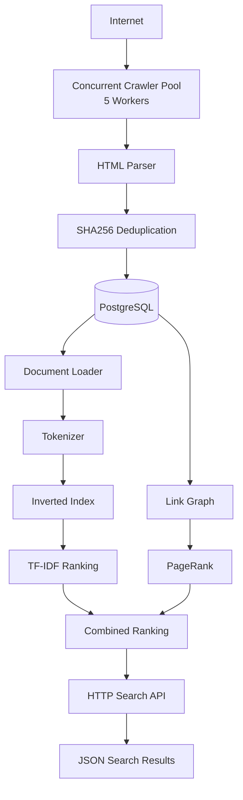
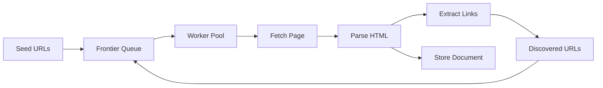
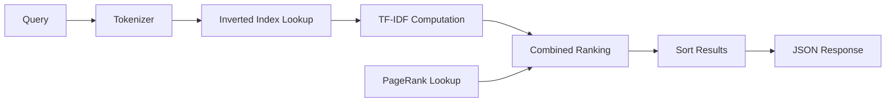
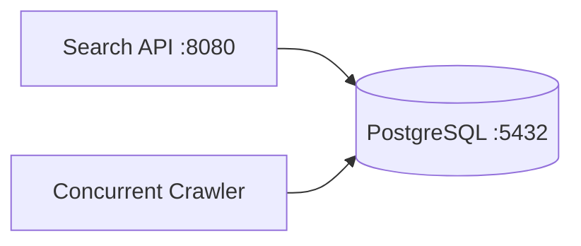
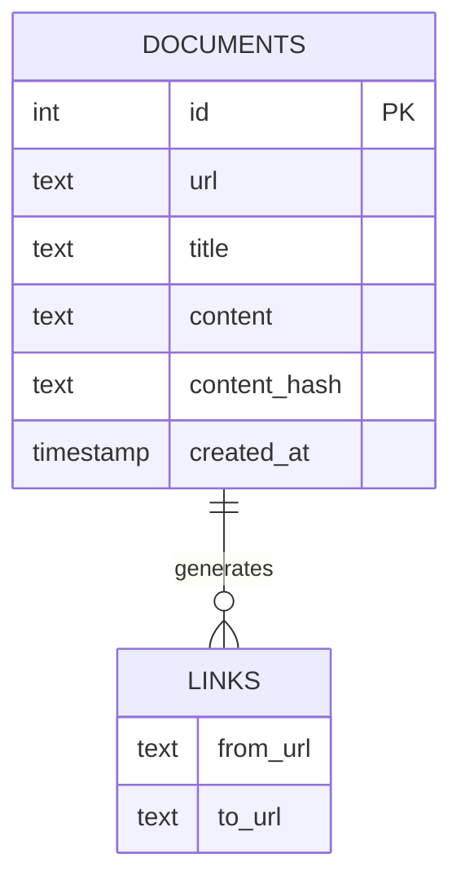

# Concurrent Search Engine (Go)

A production-style search engine built in Go that crawls and indexes web pages into a PostgreSQL-backed inverted index and serves ranked search results through an HTTP JSON API.

The system implements concurrent web crawling, SHA256-based deduplication, inverted indexing, TF-IDF and PageRank ranking, Boolean retrieval, phrase search, and Dockerized deployment.

---

# Features

## Concurrent Web Crawling

* Concurrent worker-based crawling pipeline using goroutines and channels
* Recursive web crawling from configurable seed URLs
* URL normalization and canonicalization
* robots.txt compliance
* Visited URL tracking and deduplication
* Link graph construction for PageRank

## Storage Layer

* PostgreSQL-backed document and metadata storage
* Persistent Docker volumes
* Automatic database initialization via `init.sql`
* SHA256-based content deduplication
* Incremental indexing support

## Search Engine

* Tokenization and normalization
* Inverted index with posting lists
* Positional index for phrase search
* TF-IDF ranking
* PageRank computation over crawled link graph
* Combined ranking using TF-IDF and PageRank
* Boolean query processing (AND / OR)
* Phrase search

## Search API

* HTTP JSON search endpoint
* Ranked search results
* Document URLs and ranking scores
* Sub-millisecond average query latency

## Deployment

* Dockerized crawler
* Dockerized search API
* Dockerized PostgreSQL
* Persistent database volumes
* Automatic schema initialization

---

# System Architecture



---

# Crawling Pipeline



---

# Search Pipeline



---

# Deployment Architecture



---

# Database Schema



---

# Tech Stack

### Language

* Go 1.26

### Database

* PostgreSQL 17

### Infrastructure

* Docker
* Docker Compose

### Libraries

* net/http
* goquery
* lib/pq

### Algorithms

* Inverted Index
* Positional Index
* TF-IDF Ranking
* PageRank
* Boolean Retrieval
* Phrase Search

### Systems Concepts

* Goroutines
* Channels
* Concurrent Worker Pools
* Producer-Consumer Pipelines
* Content Hashing
* Incremental Indexing
* Persistent Volumes
* REST APIs

---

# Running Locally

## Clone Repository

```bash
git clone <repo-url>
cd concurrent-search-engine
```

## Start Services

```bash
docker compose up
```

### Services

| Service    | Endpoint                        |
| ---------- | ------------------------------- |
| Search API | http://localhost:8080           |
| PostgreSQL | localhost:5433                  |
| Crawler    | Runs continuously inside Docker |

---

# Search Endpoint

### Request

```http
GET /search?q=github
```

### Example

```bash
curl "http://localhost:8080/search?q=github"
```

### Example Response

```json
[
  {
    "url": "https://github.com/features/copilot",
    "score": 933.60,
    "tfidf": 1167.00,
    "pagerank": 0.00138
  }
]
```

---

# Search Capabilities

### Term Search

```text
github
```

### Multi-word Search

```text
github copilot
```

### Boolean Search

```text
github AND copilot
github OR docker
```

### Phrase Search

```text
"github copilot"
```

---

# Performance Benchmarks

| Metric                | Result           |
| --------------------- | ---------------- |
| Pages Crawled         | 7,069+           |
| Workers               | 5                |
| Crawling Throughput   | 141.38 pages/sec |
| Documents Indexed     | 416              |
| Indexing Throughput   | 127.92 docs/sec  |
| Unique Terms Indexed  | 54K+             |
| Average Query Latency | <1 ms            |
| End-to-End Throughput | ~10 queries/sec  |

---

# Project Structure

```text
cmd/
├── crawler
├── indexer
├── searchapi
└── tokenizer

internal/
├── crawler
├── frontier
├── indexer
├── models
├── parser
├── robots
└── storage

data/
docker-compose.yml
Dockerfile
init.sql
go.mod
go.sum
```

---

# Future Improvements

* Distributed crawling across multiple nodes
* BM25 ranking
* Posting list compression
* Anchor text indexing
* Query autocomplete
* Snippet generation
* Real-time incremental indexing
* Web frontend
* Search analytics dashboard

---

# Key Learnings

This project required concepts from:

* Concurrent Systems
* Databases
* Information Retrieval
* Ranking Algorithms
* Distributed Systems
* Backend Engineering
* Containerization
* Performance Benchmarking

---
