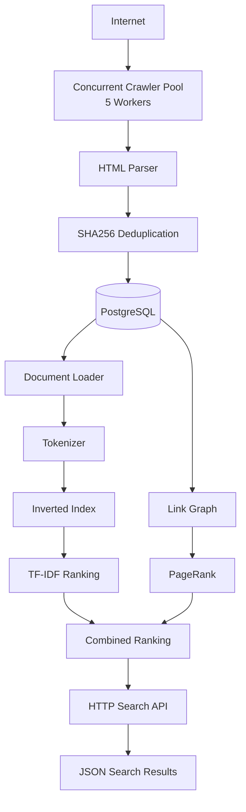

# Concurrent Search Engine (Go)

A concurrent search engine built in Go that crawls and indexes web pages into a PostgreSQL-backed inverted index and serves ranked search results through an HTTP JSON API.

The project implements a multi-stage search pipeline including concurrent crawling, content extraction, deduplication, inverted indexing, TF-IDF and PageRank ranking, Boolean retrieval, phrase search, and Dockerized deployment.

---

## Features

### Concurrent Web Crawling

* Concurrent worker-based crawling pipeline using goroutines and channels
* Recursive web crawling starting from seed URLs
* URL normalization and canonicalization
* robots.txt compliance
* Visited URL tracking and deduplication
* Link graph construction for PageRank

### Storage Layer

* PostgreSQL-backed document and metadata storage
* Persistent Docker volumes
* Automatic database initialization using startup migrations
* SHA256-based content deduplication
* Incremental indexing support

### Search Engine

* Tokenization and text normalization
* Inverted index with posting lists
* Positional index for phrase search
* Term Frequency (TF)
* TF-IDF ranking
* PageRank computation over crawled link graph
* Combined ranking:
  Final Score = f(TF-IDF, PageRank)
* Boolean query processing (AND / OR)
* Phrase search

### Search API

* HTTP JSON search endpoint
* Ranked search results
* Document URLs and scores returned as JSON
* Sub-millisecond average query latency

### Deployment

* Dockerized crawler
* Dockerized search API
* Dockerized PostgreSQL
* Persistent database volumes
* Automatic schema initialization via init.sql

---
## Architecture



---

# Tech Stack

Language:

* Go

Database:

* PostgreSQL

Libraries:

* net/http
* goquery
* lib/pq

Infrastructure:

* Docker
* Docker Compose

Algorithms:

* Inverted Index
* Positional Index
* TF-IDF Ranking
* PageRank
* Boolean Retrieval
* Phrase Search

Concepts:

* Goroutines
* Channels
* Concurrent Worker Pools
* Producer-Consumer Pipelines
* Content Hashing
* Incremental Indexing
* Persistent Volumes
* REST APIs

---

# Database Schema

documents

| Column       | Type               |
| ------------ | ------------------ |
| id           | SERIAL PRIMARY KEY |
| url          | TEXT UNIQUE        |
| title        | TEXT               |
| content      | TEXT               |
| content_hash | TEXT UNIQUE        |
| created_at   | TIMESTAMP          |

links

| Column   | Type |
| -------- | ---- |
| from_url | TEXT |
| to_url   | TEXT |

Unique Constraint:
(from_url, to_url)

---

# Search Pipeline

Query
↓
Tokenizer
↓
Inverted Index Lookup
↓
TF-IDF Computation
↓
PageRank Lookup
↓
Combined Ranking
↓
Sort Results
↓
JSON Response

---

# Running Locally

## Clone Repository

```bash
git clone <repo-url>
cd concurrent-search-engine
```

## Start Services

```bash
docker compose up
```

Services:

PostgreSQL:
localhost:5433

Search API:
http://localhost:8080

Crawler:
runs continuously inside Docker

---

# Search Endpoint

Search:

```http
GET /search?q=github
```

Example:

```bash
curl "http://localhost:8080/search?q=github"
```

Example Response:

```json
[
  {
    "url": "https://github.com/features/copilot",
    "score": 933.60,
    "tfidf": 1167.00,
    "pagerank": 0.00138
  }
]
```

---

# Search Capabilities

Term Search

```text
github
```

Multi-word Query

```text
github copilot
```

Boolean Search

```text
github AND copilot
github OR docker
```

Phrase Search

```text
"github copilot"
```

---

# Performance Benchmarks

Crawling

* Pages Crawled: 7,069+
* Workers: 5
* Throughput: 141.38 pages/sec

Indexing

* Documents Indexed: 416
* Indexing Throughput: 127.92 documents/sec
* Unique Terms Indexed: 54K+

Query Serving

* Average Query Latency: <1 ms
* End-to-End Throughput: ~10 queries/sec

---

# Project Structure

```
cmd/
├── crawler
├── indexer
├── searchapi
└── tokenizer

internal/
├── crawler
├── frontier
├── indexer
├── models
├── parser
├── robots
└── storage

data/
docker-compose.yml
Dockerfile
init.sql
go.mod
go.sum
```

---

# Future Improvements

* Distributed crawling across multiple nodes
* Anchor text indexing
* Query autocomplete
* Snippet generation
* BM25 ranking
* Compression of posting lists
* Distributed inverted indexes
* Real-time incremental indexing
* Web frontend
* Search analytics dashboard

---

# Key Learnings

This project involved building a production-style search system and required concepts from:

* Concurrent Systems
* Databases
* Information Retrieval
* Ranking Algorithms
* Distributed Systems
* Backend Engineering
* Containerization
* Performance Benchmarking

---

# Resume Summary

Built a concurrent search engine in Go that crawled and indexed 7K+ web pages using a 5-worker pipeline with robots.txt compliance, SHA256-based deduplication, and PostgreSQL-backed metadata storage. Implemented an inverted index supporting TF-IDF/PageRank ranking, Boolean retrieval, phrase search, and an HTTP JSON search API with sub-millisecond average query latency. Dockerized the crawler, API, and PostgreSQL deployment using Docker Compose with persistent volumes and automated schema initialization, achieving crawling throughput of 141 pages/sec and indexing throughput of 128 documents/sec.
